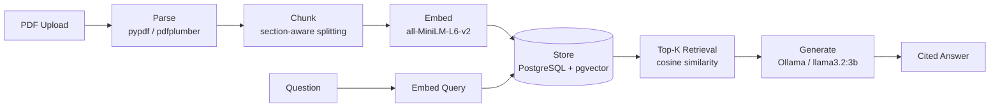

# Document Intelligence API

A Retrieval-Augmented Generation (RAG) system built from first principles — every layer (parsing, chunking, embedding, vector storage, retrieval, generation, and the API) implemented and understood individually before being wired together, rather than assembled from a framework tutorial.

> Upload a PDF → ask a question → get a grounded, cited answer — or a clear refusal when the answer isn't in the document.

## Why this project exists

Most "RAG in 10 minutes" tutorials wire together LangChain components without ever exposing what's actually happening at each layer — which makes debugging, and real engineering judgment about tradeoffs, impossible. This project takes the opposite approach: build every layer by hand first, understand its failure modes, then evaluate frameworks against that baseline.

## Architecture



## Tech stack

| Layer | Technology | Why |
|---|---|---|
| PDF parsing | `pypdf`, `pdfplumber` | Compared raw text vs. layout-aware extraction |
| Chunking | Custom section-aware splitter | Outperformed fixed-size and sentence-based chunking for structured documents |
| Embeddings | `sentence-transformers` (`all-MiniLM-L6-v2`) | Free, local, 384-dim, no API dependency |
| Vector store | PostgreSQL + `pgvector` (Docker) | Production-realistic — SQL-queryable vectors, not a toy in-memory index |
| Generation | Ollama (`llama3.2:3b`) | Fully local inference, zero API cost |
| API | FastAPI + Uvicorn | Async-ready, auto-documented (`/docs`) |

## Getting started

### Prerequisites
- Python 3.10+
- Docker Desktop
- [Ollama](https://ollama.com)

### Setup
```bash
python -m venv venv
venv\Scripts\activate          # Windows
pip install -r requirements.txt

docker run --name rag-postgres -e POSTGRES_USER=raguser \
  -e POSTGRES_PASSWORD=ragpass -e POSTGRES_DB=ragdb \
  -p 5432:5432 -d pgvector/pgvector:pg16

ollama pull llama3.2:3b
```

### Run
```bash
# CLI, interactive
python src/pipeline.py

# API service
uvicorn src.api:app --reload
# → http://127.0.0.1:8000/docs
```

## API

| Endpoint | Method | Description |
|---|---|---|
| `/health` | GET | Liveness check |
| `/documents` | POST | Upload and ingest a PDF |
| `/query` | POST | Ask a question against the ingested document |

## Known limitations (and why they're not fixed yet)

Documented honestly rather than hidden — each was found through direct testing, not assumed:

- **Table structure is lost during chunking.** Tables extract cleanly in isolation (`pdfplumber.extract_tables()`), but the current chunker uses raw text extraction, so table rows collapse into flat text. Planned fix: V2.
- **A dense "summary" chunk can dominate retrieval** for numeric questions regardless of topic, since it touches every section. Planned fix: reranking, V2.
- **Section-based chunking is currently document-specific** (hardcoded headers) rather than structurally detected (font size/boldness). Planned fix: V2.
- **Local LLM citation accuracy was inconsistent under default sampling** — diagnosed via a dedicated retrieval-vs-generation trace showing retrieval was correct while generation occasionally mis-attributed a fact to the wrong section. Fixed by setting `temperature=0.0`.

## Roadmap

This is V1 of a planned V1→V5 progression: better retrieval (hybrid search, reranking) → hardened production API (auth, async ingestion) → automated evaluation → multi-tenant scale.

## License

MIT